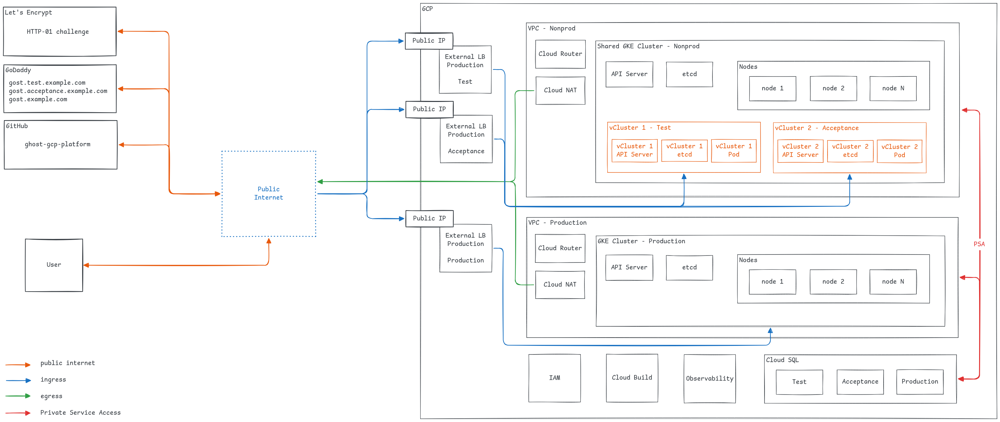

# Architecture

Ghost — currently an on-prem blog behind an NGINX reverse proxy, backed by a
MySQL cluster — moves to Kubernetes on Google Cloud (GKE), across three
environments: Test, Acceptance, Production. This document describes the
target architecture, the decisions behind it, and the assumptions it rests
on.

## 1. Requirements, and how this design meets them

| Requirement | How it's met |
|---|---|
| Kubernetes as a Service in a public cloud | GKE Autopilot — a dedicated cluster for Production, a shared cluster for Test/Acceptance |
| Ghost with an external database and persistent volumes | Cloud SQL for MySQL (one instance per environment), Ghost's content directory on a persistent volume |
| Expose Ghost securely | Gateway API (Envoy Gateway) + TLS via cert-manager on every environment |
| Automate the end-to-end deployment | Terraform (infrastructure) + Flux (application delivery) — no manual step in either |
| Metrics and logs | GKE's built-in Cloud Logging/Monitoring, plus a self-hosted Prometheus/Loki/Grafana stack |
| Infrastructure as Code, one codebase | This repository — Terraform under `infra/gcp/`, GitOps config under `gitops/` |

## 2. High-Level Design

Three environments, two GCP projects, two GKE clusters:

**Production gets full physical isolation** — its own project, its own GKE
cluster, its own VPC. This is the strongest isolation boundary GCP offers
short of a separate organization, reserved for the one environment that's
customer-facing.

**Test and Acceptance share one GKE cluster**, each running inside its own
[vCluster](https://www.vcluster.com/) — a virtual Kubernetes control plane
(its own API server, RBAC, CRDs) layered on top of the shared host cluster.
Workloads still run as real pods on the real shared nodes, so the
application layer (Helm chart, manifests, GitOps flow, real Cloud SQL
connectivity) is genuinely validated — only the underlying node pool,
networking, and storage class are shared rather than dedicated. Every
environment still gets its **own Cloud SQL instance** regardless of what
compute it shares — database isolation is unconditional.

This asymmetry is deliberate: isolation strength matches business impact.
Paying for a third full GKE cluster to isolate two non-customer-facing
environments from each other doesn't buy anything Production actually needs;
skipping isolation for Production would.

**Why vCluster over a plain namespace:** a namespace only isolates
resources, not the control plane — a compromised or noisy Test workload can
still see and query the shared API server. vCluster gives Test and
Acceptance a real control-plane boundary (own API server, own RBAC, own
CRDs) without the cost of a separate physical cluster, and it's
indistinguishable from a real cluster to `kubectl`, Helm, or Flux — nothing
bespoke to operate on top of standard tooling. It also decouples each
environment's Kubernetes version from the host cluster's, so a version
bump can be validated in Test before it ever touches the shared host.

**What this doesn't prove**, stated plainly rather than glossed over: a
green Test/Acceptance run validates the application layer, not the
underlying cluster's own properties (node pool configuration, networking,
storage classes) — Production runs on a physically separate cluster, so
that layer isn't exercised by Test/Acceptance directly. Both clusters come
from the same Terraform module with matching settings, so infrastructure
parity is enforced by construction, not inferred from a passing pipeline.

## 3. Compute: GKE Autopilot

Both clusters run in **Autopilot** mode rather than Standard — Google
manages node provisioning, sizing, and patching; this repository only
declares workload resource requests/limits, never node pools. This removes
an entire category of operational work (node pool sizing, OS patching,
security baseline) that doesn't differentiate this platform from any other
GKE deployment.

Cloud Logging (`SYSTEM_COMPONENTS` + `WORKLOADS` log components) and Cloud
Monitoring (Google Cloud Managed Service for Prometheus) are enabled by
default on Autopilot and not disabled — every pod's logs and baseline
metrics reach the GCP Console with no extra agent to install. See
[MONITORING.md](MONITORING.md) for what's layered on top.

## 4. Networking

Each GCP project has its own VPC, its own Cloud NAT (for outbound internet
access — pulling container images, ACME validation, etc.), and its own
firewall rules. The two VPCs are **not peered** — Test/Acceptance and
Production have no network path to each other, matching the isolation goal
in §2. (A hub-and-spoke topology — a central VPC peered to per-environment
spokes — was considered and set aside; see [ROADMAP.md](ROADMAP.md) for
why.)

Traffic reaches Ghost through the [Kubernetes Gateway
API](https://gateway-api.sigs.k8s.io/), implemented by
[Envoy Gateway](https://gateway.envoyproxy.io/): a `Gateway` resource per
environment provisions a cloud `LoadBalancer` Service, and an `HTTPRoute`
attaches Ghost to it. See [ROUTING.md](ROUTING.md) for the full
public-IP-to-pod request path.

**TLS** is issued by [cert-manager](https://cert-manager.io/), but the
issuer differs by environment:

| Environment | Issuer | Why |
|---|---|---|
| Test / Acceptance (local demo) | `SelfSigned` | ACME (Let's Encrypt) has no way to validate a certificate for a hostname that only resolves on `localhost` — there's no public DNS record or public HTTP reachability to prove domain ownership |
| Test / Acceptance / Production (real GKE) | Let's Encrypt, HTTP-01 challenge | HTTP-01 only needs the Gateway to answer a challenge request on port 80 for the domain — it doesn't require GCP to control DNS for that domain |

**DNS stays at GoDaddy, not migrated to a GCP-hosted zone** — an explicit
assumption, not an oversight. The client's existing domain registration
isn't part of this migration's scope, and HTTP-01 validation doesn't need
DNS-level access at all, so there's no functional reason to force a DNS
migration just to get TLS working. A GoDaddy A record per environment,
pointed at that environment's reserved external IP, is sufficient. (This is
also why there's no `dns/` Terraform module in this repository — deliberately
absent, not unfinished.)

Each environment's external IP is a **reserved, not ephemeral**, GCP
address (`google_compute_address`, `address_type = "EXTERNAL"`) — an
ephemeral IP is stable in practice but not guaranteed to survive the
Service/Gateway being deleted and recreated, which would silently break a
manually-managed GoDaddy A record. Reserving it up front makes that DNS
record actually trustworthy long-term.

## 5. Data

**Cloud SQL for MySQL** — one instance per environment, always, regardless
of which GKE cluster or vCluster hosts the compute. Reachable over
**Private Service Access (PSA)**: a private IP peered into the VPC via
`servicenetworking.googleapis.com`, no public IP on the database at all.
(Private Service Connect — a different, endpoint-based mechanism — was
considered; PSA fits better here since there's no Shared VPC or
cross-project consumption to justify PSC's extra setup.)

**Authentication**: Ghost's pods use **Workload Identity** — a Kubernetes
ServiceAccount is bound to a GCP service account scoped to exactly that
environment's own Cloud SQL and Secret Manager resources, no service
account key files mounted into any pod.

**Secrets**: on real GKE, the database password lives in **Secret
Manager**, bridged into the cluster via the **Secrets Store CSI Driver** —
a `SecretProviderClass` mounts the secret into Ghost's pod and mirrors it
into a native Kubernetes `Secret` for anything that needs an env var rather
than a file. In the local demo (no GCP dependency, zero cloud spend), the
same role is played by **SOPS + age**: the secret is committed to git
encrypted, and Flux's `kustomize-controller` decrypts it at reconcile time
using a key that's never itself committed.

**Ghost's own content** (image uploads, theme files) needs a persistent
volume, separate from the database:

| Environment | Storage | Access mode |
|---|---|---|
| Local demo | vCluster's default local-path StorageClass | `ReadWriteOnce` — single node, single replica |
| Real GKE | Filestore, via GKE's CSI driver | `ReadWriteMany` — available if Ghost ever needed multiple replicas sharing content |

Ghost runs as a **single replica in every environment**, on both tracks —
see [ROADMAP.md](ROADMAP.md) for why horizontal scaling is ruled out, not
just deferred.

## 6. Application delivery and infrastructure automation

Two automation engines, one clean boundary: **Terraform (via Cloud Build)
provisions infrastructure — projects, networking, GKE, Cloud SQL, and the
vCluster/Flux installs themselves; Flux delivers the application to
whatever's underneath, and can't tell a vCluster from a real cluster.**
Neither ever does the other's job. Full detail in
[AUTOMATION.md](AUTOMATION.md) and [IAC.md](IAC.md); the commit-to-running-change
walkthrough is in [FLOW.md](FLOW.md).

## 7. Local demo vs. real GKE

The same Helm chart and the same GitOps structure drive both tracks — the
only things that differ are environment-specific values (hostnames,
database endpoints, storage classes, TLS issuer) supplied through Kustomize
overlays, never hardcoded into the chart. This is what makes the local demo
a genuine rehearsal of the real deployment mechanism, not a separate,
parallel design:

| | Local demo | Real GKE |
|---|---|---|
| Compute | 3 vClusters on Docker, one laptop | 2 real GKE Autopilot clusters, 2 GCP projects |
| Database | MySQL container, applied directly (outside Flux) | Cloud SQL, provisioned by Terraform |
| TLS | `SelfSigned` issuer | Let's Encrypt, HTTP-01 |
| Content storage | Local-path PVC | Filestore |
| Cost | Zero cloud spend | Real GCP billing |
| Purpose | Fast iteration, demonstrable without cloud credentials | The actual target |

The local demo is deliberately **more symmetric** than real GKE — all three
environments run as vClusters locally, purely for uniform, fast-to-bootstrap
tooling on a single machine. That's a simplification of the demo, not a
claim that Production "really" runs virtualized — real GKE's Production has
no vCluster layer at all (§2).

## 8. Assumptions

Stated explicitly, as the assignment asks:

- **DNS stays at GoDaddy.** Not migrated to Cloud DNS — see §4.
- **The two GCP projects (`nonprod`, `production`) already exist** and are
  adopted by Terraform (`project_reuse`), not created by it — no
  organization/folder hierarchy is provisioned by this repository.
- **Ghost runs at a single replica everywhere.** Ghost's own upstream
  documentation rules out multi-instance clustering — see
  [ROADMAP.md](ROADMAP.md) for the full reasoning and the alternative scale
  path (cache/CDN).
- **Regional vs. zonal GKE control-plane/node distribution** hasn't been
  decided — this document covers isolation *between* environments, not
  each cluster's own availability posture across zones. Tracked in
  [ROADMAP.md](ROADMAP.md).
- **Backup/disaster recovery policy** (Cloud SQL retention/PITR, content
  volume snapshots) hasn't been decided — Cloud SQL has automated backups
  by default, but retention, cross-region copies, and content-volume backup
  are open questions, not a design yet. Tracked in
  [ROADMAP.md](ROADMAP.md).

## 9. Benefits of this design

- **Isolation matched to risk, not applied uniformly** — Production doesn't
  pay for more isolation than a namespace would give it in Test; Test
  doesn't get the cost of a cluster it doesn't need.
- **One deployment mechanism for three environments.** The same Helm
  chart, the same Kustomize structure, the same Flux reconcile loop —
  environment differences are data (values), not forked code paths.
- **No manual deployment step, anywhere.** A git push is the entire
  "deploy" action for the application; a Terraform PR plus a review is the
  entire "provision infrastructure" action. Neither requires a person to
  run a command against a live environment.
- **Provably reproducible.** The local demo runs the identical GitOps
  structure real GKE does — anyone can clone this repository and see the
  same deployment mechanism work without needing cloud credentials first.
- **No cloud lock-in beyond GCP's own managed services.** vCluster, Flux,
  cert-manager, Envoy Gateway, and the Ghost chart itself are all open
  source and portable; only Cloud SQL, Secret Manager, and GKE Autopilot
  are GCP-specific, and each is a narrow, swappable piece.
