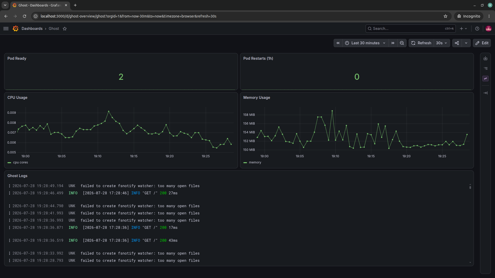

# Monitoring

Two layers of observability run side by side: GCP's own, built into GKE
Autopilot with no extra setup (covered in
[ARCHITECTURE.md](ARCHITECTURE.md) §3), and a self-hosted Prometheus/Loki/
Grafana stack that this repository installs and owns. This document covers
the second one — what it's made of, and what it actually shows.

## Components

| Component | Role |
|---|---|
| **kube-prometheus-stack** | Prometheus (metrics), Alertmanager, kube-state-metrics, node-exporter, and Grafana itself, bundled as one Helm chart |
| **Loki** | Log storage and querying |
| **Alloy** | Log collection agent — reads pod logs and ships them to Loki |
| **Grafana** | Dashboards, using both Prometheus and Loki as datasources |

All four are Flux-managed `HelmRelease`s under
`gitops/platform/controllers/all/monitoring/` — installed and upgraded the
same way as every other controller in this repository, not a bolt-on.

### Why Alloy instead of Promtail for log collection

Alloy reads logs through the Kubernetes API's `pods/log` endpoint — the
same mechanism `kubectl logs` uses — rather than mounting the node's
`/var/log/pods` directory via `hostPath`. That distinction matters
specifically because Test and Acceptance run inside vClusters: a vCluster
virtualizes the control plane, not the node filesystem, so a `hostPath`
mount would need to see the *real* host node's logs, not just the
containers scheduled by that vCluster's own scheduler — an assumption
that doesn't reliably hold. Going through the API server's own proxy layer
avoids that assumption entirely, at the cost of slightly more load on the
API server than a direct file read.

## Dashboards travel with the app they describe

Ghost's own Grafana dashboard is defined in
`gitops/apps/base/ghost/dashboard.yaml` — inside the application's own
folder, not inside the monitoring stack's. Grafana's sidecar container
watches for any `ConfigMap` carrying the label `grafana_dashboard: "1"`,
across every namespace, and loads it automatically. This means adding a
new dashboard for a future service never requires touching anything under
`gitops/platform/controllers/all/monitoring/` — it's picked up the moment
the owning application defines it.

## What the Ghost dashboard actually shows



Five panels, in the order they matter for a quick health check:

- **Pod Ready** — count of Ghost pods currently in the `Running` phase.
- **Pod Restarts (1h)** — a sudden nonzero value here is usually the first
  sign something's wrong (a crash loop, an OOM kill).
- **CPU Usage** / **Memory Usage** — resource consumption over time,
  against the limits set in the chart's values.
- **Ghost Logs** — a live tail of Ghost's own stdout, queried from Loki,
  filtered to the `ghost` namespace. The screenshot above shows real
  traffic (`GET / 200`) alongside a genuine — and harmless — Ghost startup
  warning (`failed to create fsnotify watcher: too many open files`),
  exactly as it appears with no manual annotation.

## Access

Not exposed through the Gateway alongside Ghost — reached with a
port-forward:

```bash
kubectl --context <cluster-context> -n monitoring port-forward \
  svc/<release-name>-grafana 3000:80
```

The exact service name depends on the Helm release name Flux generates
(it prefixes the release with the target namespace) — check with
`kubectl -n monitoring get svc` if the port-forward target isn't obvious.
Login is `admin`; the password is generated by the chart, not set in this
repository — read it from the Kubernetes `Secret` the chart creates rather
than assuming a default:

```bash
kubectl --context <cluster-context> -n monitoring get secret <release-name>-grafana \
  -o jsonpath='{.data.admin-password}' | base64 -d
```

## Alerting

Flux's own `notification-controller` — already part of every Flux
install, nothing extra to add — watches the whole GitOps pipeline (every
`Kustomization` and `HelmRelease`, not just Ghost's) and posts to Slack via
a webhook URL held in a SOPS-encrypted secret, never committed in
plaintext. This means a broken promotion, a failed reconcile, or a bad tag
anywhere in the chain surfaces in Slack, not just Ghost's own deploys.

This is deliberately scoped as **infrastructure-level alerting** (did a
deployment succeed or fail), not **application-level alerting** (is Ghost
actually serving traffic correctly) — the latter would need alert rules
defined against the Prometheus/Loki data already being collected, which
isn't built yet. See [ROADMAP.md](ROADMAP.md).

## Demo-track scope note

The local demo runs the full monitoring stack on **Test only**, not on
Acceptance or Production — a laptop resource budget (three vClusters
sharing one machine) doesn't fit the stack running three times over
simultaneously. This is a demo-only restriction: the exact same manifests
run unchanged on all three real GKE environments, where that constraint
doesn't exist.
